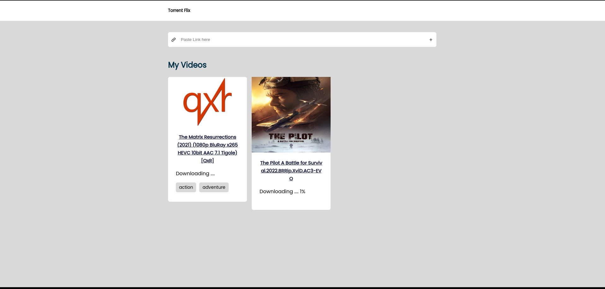

# Screenshots



# Installation

## Server

```sh
cd packages/server
npm install
npm run watch
```

## Client

```sh
cd packages/web
npm install
npm run dev
```

# Features

- Can download videos from magnet link
- Stream downloaded videos
- Realtime download progress for downloading videos

# TODO

- [ ] Error Page for videos
- [ ] Use `ffmpeg` to stream videos
- [ ] Show videos according to the user
- [ ] Add validation to check magnet links
- [ ] User SignIn / Registration page
- [ ] Make site responsive for mobile
